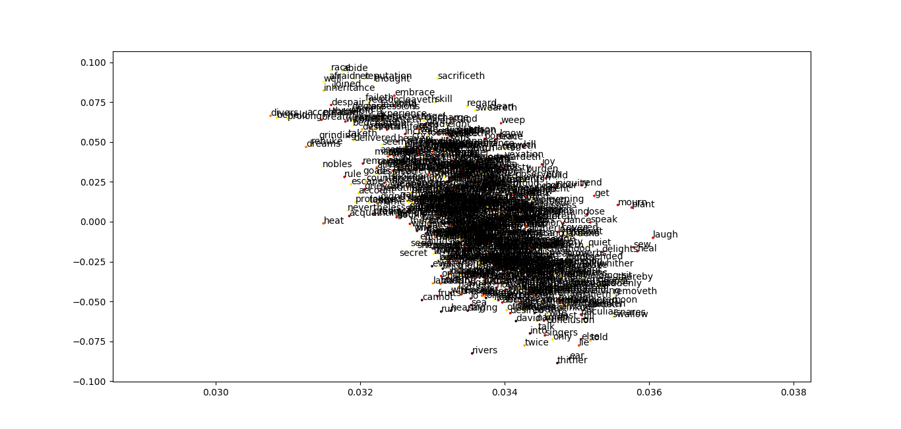

# word2vec
An attempt at word2vec with negative sampling. Trained on Ecclesiastes.

Keep in mind, that this is a *very rudimentary* implementation... with Nesterov's Accelerated Gradient Descent (NAG):

which takes the form of:

$$v_{t+1} = \mu v_{t}-\eps \nabla f(\theta_{t}+\mu v_{t})$$
$$\theta_{t+1} = \theta_{t} + v_{t+1}$$